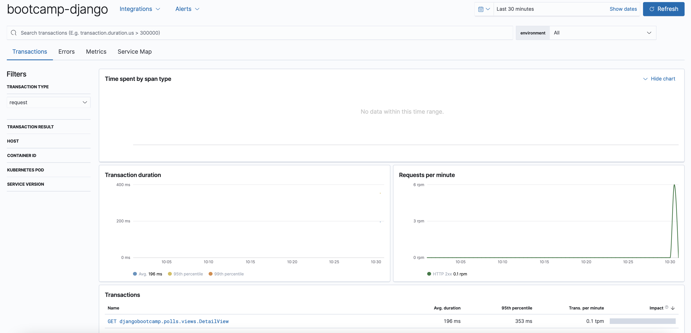
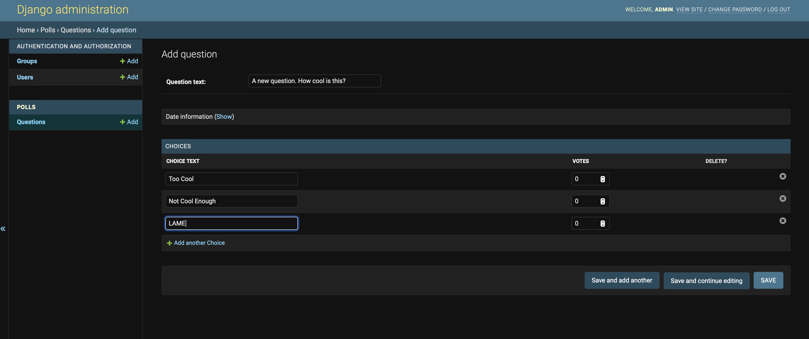
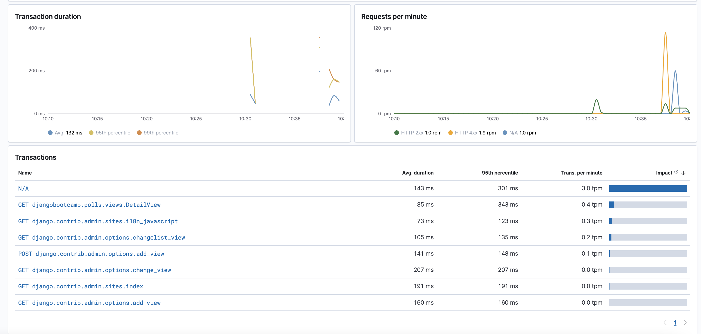
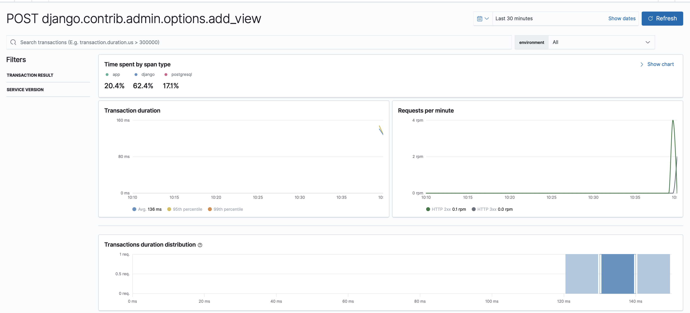
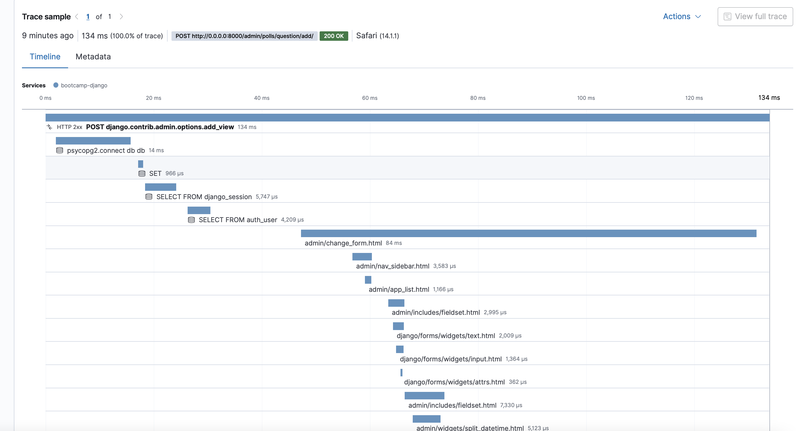
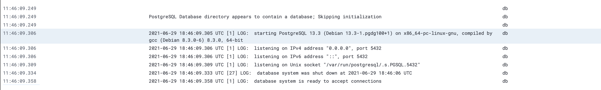

# 2021 Bootcamp CI/CD & Docker (pt. 2)

<!-- TOC -->

- [Bootcamp CI/CD & Docker pt. 2](#bootcamp-cicd--docker-pt-2)
    - [The Power of Docker](#the-power-of-docker)
        - [docker-compose refresher](#docker-compose-refresher)
    - [Advanced Docker Compose Example](#advanced-docker-compose-example)
        - [Step 1: Create Django Project](#step-1-create-django-project)
            - [Deploy Django Service](#deploy-django-service)
            - [Exec into Django](#exec-into-django)
            - [Create a Poll](#create-a-poll)
            - [Create some answers](#create-some-answers)
            - [Exit the shell](#exit-the-shell)
            - [Recap](#recap)
        - [Step 2: Deploy the Elastic Stack](#step-2-deploy-the-elastic-stack)
            - [What is the Elastic Stack?](#what-is-the-elastic-stack)
                - [Elasticsearch](#elasticsearch)
                - [Kibana](#kibana)
                - [Elastic-APM](#elastic-apm)
                - [Filebeat](#filebeat)
            - [Deploy the Elastic Stack](#deploy-the-elastic-stack)
                - [Use the Elastic Stack](#use-the-elastic-stack)
        - [Step 3: Tie Application Performance Metrics APM into Django](#step-3-tie-application-performance-metrics-apm-into-django)
            - [Using Override Files](#using-override-files)
        - [Step 4: Use the Django Site to generate some Transactions](#step-4-use-the-django-site-to-generate-some-transactions)
        - [Step 5: Dive into APM](#step-5-dive-into-apm)
    - [Using docker-compose override files to perform testing](#using-docker-compose-override-files-to-perform-testing)
    - [Challenges](#challenges)
        - [Challenge 1: Run the tests using a docker-compose exec command](#challenge-1-run-the-tests-using-a-docker-compose-exec-command)
        - [Challenge 2: Run the Django site on a different local port 8001](#challenge-2-run-the-django-site-on-a-different-local-port-8001)
        - [Challenge 3: Send the Database Logs to Elasticsearch](#challenge-3-send-the-database-logs-to-elasticsearch)
    - [Wrapping up](#wrapping-up)
        - [Clean up the environments](#clean-up-the-environments)
            - [Clean Django](#clean-django)
            - [Clean the Elastic Stack](#clean-the-elastic-stack)
        - [Fun Docker Containers](#fun-docker-containers)
        - [Final Thought](#final-thought)

<!-- /TOC -->

In Part 1, you learned about:

- Docker Images
- Docker Commands
- Docker-Compose

In this session, we are going to expand on the concept of using docker-compose to build really powerful environments.

## The Power of Docker

### docker-compose refresher

Docker-compose makes it super easy to get started with open-source software. Since it's a standardized and versioned format, you can be sure that it'll work the same across environments and ecosystems. In their words:

>> Compose is a tool for defining and running multi-container Docker applications. With Compose, you use a YAML file to configure your application’s services. Then, with a single command, you create and start all the services from your configuration. 


## Advanced Docker Compose Example

### Step 1: Create Django Project

> In this example, we are going to use the end result of the `Writing your first Django app` tutorial on their [website](https://docs.djangoproject.com/en/3.2/intro/). Don't worry, you won't have to go through the tutorial yourself, but it's important to know where this code is coming from. All this example does is provide an example Polls application written in Django. If you aren't familiar, Django is a python framework for developing dynamic and modern websites. For this tutorial, you won't need to be a Django expert, just realize that it's creating a website for you when we run our first docker-compose.

Here's what the first [docker-compose.yml](Django/docker-compose.yml) looks like:

```yaml
version: "3.9"
   
services:
  db:
    image: postgres
    volumes:
      - ./data/db:/var/lib/postgresql/data
    environment:
      - POSTGRES_DB=postgres
      - POSTGRES_USER=postgres
      - POSTGRES_PASSWORD=postgres
    healthcheck:
      test: [ "CMD-SHELL", "pg_isready" ]
      interval: 10s
      timeout: 5s
      retries: 5
  web:
    build: .
    volumes:
      - .:/code
    environment:
      ELASTIC_APM_ENABLED: "false"
      ELASTIC_APM_SERVICE_NAME: bootcamp-django
    ports:
      - "8000:8000"
    depends_on:
      db:
        condition: service_healthy
```

The first service created is the Postgres database. This allows our Django site to store and maintain it's application state. In this example, we simply use a local directory (via `volumes`) for its database storage, and you'll see that created automatically for you by compose. We also pass through some environment variables which represent how we connect to the postgress database from Django. We have added a healthcheck for this service so that our UI doesn't start up before it's database is ready.

The second service is our [Django application](Django/). We use the `volumes` declaration to mount our Django code into the container. This allows us to make changes to the website code files, and have them reflected immediately via Django's autoreload mechanism. We also specify that we depend on the postgres service, by adding the `condition: service_healthy` flag under the `depends_on` section.

#### Deploy Django Service

```bash
$ cd Part\ 2/Django/
$ docker-compose up -d


...
Starting django_db_1 ... done
Starting django_web_1 ... done
```

Congrats! Your website should now be running at http://0.0.0.0:8000. The admin endpoint is running at: http://0.0.0.0:8000/admin/. The credentials for the admin endpoint are:

```yml
Username: admin
Password: bootcamp
```

#### Exec into Django

Using docker-compose commands, we are able to access the Django Command Line Interface (CLI) in order to run useful commands. For example, let's use the CLI to create a poll for our website.

```bash
$ docker-compose exec web python manage.py shell

DEBUG=True
Python 3.9.5 (default, Jun 23 2021, 15:01:51) 
[GCC 8.3.0] on linux
Type "help", "copyright", "credits" or "license" for more information.
(InteractiveConsole)
>>> 
```

We are now in the interactive Python shell for Django! We are able to run a lot of useful commands here, such as flushing the database, creating superusers, modifying database objects, and more.

Let's import the code we need:
```python
>>> from djangobootcamp.polls.models import Choice, Question
>>> from django.utils import timezone
```

Then let's list our polls:
```python
>>> Question.objects.all()

<QuerySet []>
```

So we don't have any polls so far, this is expected. Let's create one!

#### Create a Poll

```python
>>> question_text = "Which is best, tabs or spaces?"
>>> q = Question.objects.create(question_text=question_text, pub_date=timezone.now())

<Question: Which is best, tabs or spaces?>
```

Save the question to the database.

```python
>>> q.save()
>>> q.id  # We now have an id!
```

Check the possible answers to the question:

```python
>>> q.choice_set.all()

<QuerySet []>
```

#### Create some answers

We don't have any possible answers yet, so let's create some:

```python
>>> q.choice_set.create(choice_text='Tabs', votes=0).save()
>>> q.choice_set.create(choice_text='Spaces', votes=0).save()
>>> q.choice_set.create(choice_text='But why does it matter?', votes=0).save()
```

Ok now we have some possible answers, let's make sure they exist:

```python
>>> q.choice_set.all()

<QuerySet [<Choice: Tabs>, <Choice: Spaces>, <Choice: But why does it matter?>]>
```

Perfect, I think we're ready to accept some answers at the site [URL](http://localhost:8000).

#### Exit the shell

```python
>>> exit()
```

#### Recap

With just a few lines, we were able to create a fully functional website, using commands from inside of the container. Are you a docker believer yet?

### Step 2: Deploy the Elastic Stack

> Now that we have a website running, it's very important to include some monitoring around it so that we can validate that things are working as we expect. For this section, we are going to deploy the popular [Elastic stack](elastic.co) so that we can use their powerful tools to check on our site.

#### What is the Elastic Stack?

At a high level, the Elastic stack contains a bunch of different applications that help developers monitor and track their programs. In this session, we will deploy the following tools from the Elastic Stack:

##### Elasticsearch


Elasticsearch is an indexing application that allows you to search through large datasets. It is the foundation for all of the other components of the Elastic Stack.

##### Kibana

Kibana is the UI frontend into Elasticsearch. It's extremely powerful in terms of building visualizations and dashboards around your data. Most people rarely interact with Elasticsearch directly - Rather, they use Kibana as a middle-man to see the data they are looking for.

##### Elastic-APM
Elastic APM is a service that allows you to instrument and monitor the performance of your code. Using Elastic APM, you are able to see detailed insights into the minor details of the performance of your code. This tool is a must-have for production apps on my team.

##### Filebeat

Filebeat is a log shipper. The purpose of it is to feed data into Elasticsearch from various sources. In this example, it's included to ship your local Docker logs into Elasticsearch.
#### Deploy the Elastic Stack

```bash
$ cd ../ELK
$ docker-compose up -d  # This might take a while...

...
Creating es ... done
Creating filebeat         ... done
Creating elk_apm-server_1 ... done
Creating kib              ... done
```

After running that command, you will have a multitude of services avaiable to you. You can always check them with `docker-compose ps`.


```bash
$ docker-compose ps


      Name                    Command                       State                                                 Ports                                       
--------------------------------------------------------------------------------------------------------------------------------------------------------------
elk_apm-server_1   /usr/local/bin/docker-entr ...   Up (healthy)            127.0.0.1:6060->6060/tcp, 127.0.0.1:8200->8200/tcp                                
es                 /tini -- /usr/local/bin/do ...   Up (healthy)            0.0.0.0:9200->9200/tcp,:::9200->9200/tcp, 0.0.0.0:9300->9300/tcp,:::9300->9300/tcp
filebeat           /usr/local/bin/docker-entr ...   Up                                                                                                        
kib                /usr/local/bin/dumb-init - ...   Up (health: starting)   0.0.0.0:5601->5601/tcp,:::5601->5601/tcp
```

> See how the above logs show `healthy` for some of the services? That's because these services have a `HEALTHCHECK` defined. This allows you to make sure that the individual containers in your services are working as you expect.

##### Use the Elastic Stack

You should now see your application logs from Django when you visit: http://localhost:5601/app/logs/

When you perform actions on the website, such as going to a new page, you'll see those actions reflected in the logs in Kibana.

This is pretty cool, but what else can we do with Kibana?
### Step 3: Tie Application Performance Metrics (APM) into Django

To do this, we are going to introduce the concepts of a docker-compose override.

> What does an override do? Well it allows you to override specific properties in the main docker-compose.yml file. Why would we want to do this? There are a lot of reasons to use override files, but we are going to focus on one for this session.

- Use override files to define environment properties 
    - For example, consider a development environment with dev, test, and prod servers. 
        - docker-compose.dev.yml
        - docker-compose.test.yml
        - docker-compose.prod.yml
    - The various override files for the environments would contain differentiating config options. These files might include overrides for the environment variables sent to the application, which networks to use, which volumes to use, etc.


In this example, we have a file called [docker-compose.apm.yml](Django/docker-compose.apm.yml). 

```yml
version: "3.9"
   
services:
  web:
    environment:
      ELASTIC_APM_SERVER_URL: "http://apm-server:8200"
      ELASTIC_APM_ENABLED: "true"
      ELASTIC_APM_SECRET_TOKEN: ""
      ELASTIC_APM_DEBUG: "true"
    networks: 
        - elk_elastic
  db:
    networks: 
        - elk_elastic

networks: 
    elk_elastic:
        external: true
```

This file provides the following overrides:
- Configure Elastic APM using environment variables to define the config
- Add Django + DB to the docker network for Elasticsearch
- Tells docker that the definition and creation of the `elk_elastic` network happens elsewhere

#### Using Override Files

First, let's go back to the directory for Django

```bash
$ cd ../Django
```

Now all we need to do to use an override file is to include the path in our `docker-compose` command.

```bash
$ docker-compose -f docker-compose.yml -f docker-compose.apm.yml up -d

...
Recreating django_db_1 ... done
Recreating django_web_1 ...
```

> Note: The default name of the docker-compose override file is `docker-compose.override.yml`. If you include a file with this name in the same directory as the normal docker-compose.yml, it'll automatically be included in the up command. In this case though, we don't want it automatically included, so we will specify it directly.

That's it! Now Django is setup to use APM for monitoring the performance of the codebase. 

To view your APM transactions, simply head to the [APM section](http://localhost:5601/app/apm#/services/bootcamp-django/transactions?rangeFrom=now-30m&rangeTo=now&refreshInterval=0&refreshPaused=true&transactionType=request) in Kibana. If you made some requests to Django, it should look something like the following:


### Step 4: Use the Django Site to generate some Transactions

Let's create a poll using the admin interface in Django.

- Create a poll with the admin interface: http://0.0.0.0:8000/admin/polls/question/
 

- After it's created, you'll see the web transactions used to make this request.   

### Step 5: Dive into APM

Now that we have some transactions, let's dive into one of the transaction categories to learn more information about that request. If you followed the above guide to create a poll using the admin interface, you should have a transaction called `POST django.contrib.admin.options.add_view`. Click on that transaction and you are brought to a page like this:

  

This is a really cool timeline view of the various transactions that have happened in the duration of the time selector in the top right.

Click on a transaction and you'll get a waterfall overview of the tasks that the Django application took in order to render the website. These include things like db lookups, computational tasks, and the rendering of the various web elements.



Using APM, we allow for really powerful analysis into the performance of your application. When running large-scale deployments in production, APM provides insights that developers could only dream of 5-10+ years ago.

## Using docker-compose override files to perform testing

Consider the very simple [docker-compose.tests.yml](Django/docker-compose.tests.yml)

```yml
version: "3.9"
   
services:
  web:
    entrypoint: "python manage.py test"
```

All this override file is doing is telling the web container that we want to run tests instead of the default entrypoint command (defined in the `Dockerfile`). This allows us to completely change what the container's function is. Instead of running the Django app, we are now just going to run tests!

```bash
$ docker-compose -f docker-compose.yml -f docker-compose.tests.yml up --exit-code-from=web web

...
web_1  | ..........
web_1  | ----------------------------------------------------------------------
web_1  | Ran 10 tests in 0.155s
web_1  | 
web_1  | OK
web_1  | Destroying test database for alias 'default'...
```

That's all it took to run the tests! Which provides us the foundation for Continuous Integration (the CI part of CI/CD). If we hooked this test command into an automated system like Jenkins, we'd be able to deliver test results on each build. Pretty easy right? 

## Challenges
### Challenge 1: Run the tests using a `docker-compose exec` command

<details><summary>Answer</summary>
<p>

Start Django if it's not running

```bash
$ docker-compose up -d
```

Run the exec command

```bash
$ docker-compose exec web python manage.py test

...
..........
----------------------------------------------------------------------
Ran 10 tests in 0.174s

OK
Destroying test database for alias 'default'...
```

</p>
</details>

### Challenge 2: Run the Django site on a different local port (8001)

<details><summary>Answer</summary>
<p>

Stop Django if it's running

```bash
$ docker-compose down

Stopping django_web_1 ... 
Stopping django_db_1  ...
```

Modify the `docker-compose.yml` file directly

Change
```yml
    ports:
      - "8000:8000"
```

to 

```yml
    ports:
      - "8001:8000"
```

Then run `docker-compose up -d`.

Once it's launched: 

```bash
$ curl http://localhost:8001

<link rel="stylesheet" type="text/css" href="/static/polls/style.css" />
...
```

</p>
</details>

### Challenge 3: Send the Database Logs to Elasticsearch

> Hint: Compare the service definitions for `web` and `db` in [docker-compose.yml](Django/docker-compose.yml). What's different about them?


<details><summary>Answer</summary>
<p>

The answer is in the labels. Add the following label to the db service:

```yml
...
labels:
      co.elastic.logs/enabled: true
...
```

Then redeploy the service

```bash
$ docker-compose up -d

...
Recreating django_db_1 ... done
django_web_1 is up-to-date
```

Now check [Kibana](http://localhost:5601/app/logs/stream?flyoutOptions=(flyoutId:!n,flyoutVisibility:hidden,surroundingLogsId:!n)&logFilter=(expression:%27container.labels.com_docker_compose_service%20:%20%22db%22%27,kind:kuery)&logPosition=(end:now,position:(tiebreaker:15300,time:1624992369249),start:now-1d,streamLive:!f)) for the logs. You should see lines like this: 



</p>
</details>

## Wrapping up

### Clean up the environments

Once you are done with everything, let's clean up your local containers so that you don't have these processes running in the background.

#### Clean Django

```bash
$ cd ../Django
$ docker-compose down -v  # remove any created volumes

...
Stopping django_db_1  ... done
Stopping django_web_1 ... done
Removing django_db_1  ... done
Removing django_web_1 ... done
Removing network django_default
```

#### Clean the Elastic Stack

```bash
$ cd ../Elk
$ docker-compose down -v  # remove any created volumes

...
Stopping kib              ... done
Stopping elk_apm-server_1 ... done
Stopping filebeat         ... done
Stopping es               ... done
Removing kib              ... done
Removing elk_apm-server_1 ... done
Removing filebeat         ... done
Removing es               ... done
Removing network elk_elastic
Removing volume elk_esdata
Removing volume elk_fbdata
```

### Fun Docker Containers

I run these using docker-compose at my house on a Synology NAS.

- Run GitLab (opensource github clone): https://docs.gitlab.com/omnibus/docker/
- Add non-HomeKit items to Apple Home: https://github.com/oznu/docker-homebridge
- Minecraft Server: https://hub.docker.com/r/roemer/bedrock-server
- ARK Server: https://hub.docker.com/r/boerngenschmidt/ark-docker/
- Download photos in iCloud: https://hub.docker.com/r/boredazfcuk/icloudpd
- Run a Plex server: https://hub.docker.com/r/linuxserver/plex

### Final Thought

> Hopefully this was a fun excercise to go through in order to get more familiar with docker and compose. The sky is the limit with what you can do by chaining docker-containers together. What will you create using compose? How can you incorporate compose into your development environments? 
